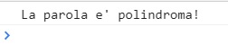
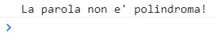
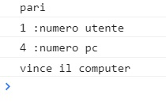
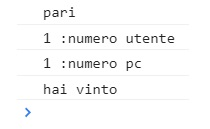

# Js-paliedispari
* Exercise 1: Create a function to check if a word is palindrome.
* Exercise 2: The user chooses even or odd and a number from 1 to 5.
The computer generates a number from 1 to 5.
The two numbers are summed and the winner is declared.
***
### [Live Website ES1](https://gianluigivitale.github.io/js-paliedispari/es1%20parola%20palindroma)
### [Live Website ES2](https://gianluigivitale.github.io/js-paliedispari/es2%20gioco%20pari%20dispari)
***
### Preview ES1:  
word: **anna**    
  
word: **hi**   
  
### Preview ES2:  
pc wins:  
   
user wins:  
  
